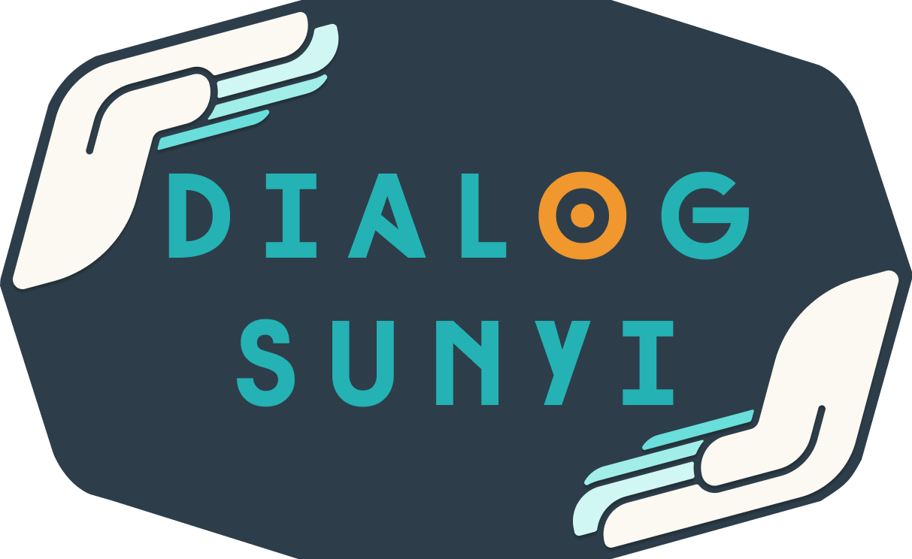

# Dialog Sunyi

Selamat datang di **Dialog Sunyi**, sebuah platform yang berdedikasi untuk memperluas akses dan kesadaran terhadap bahasa isyarat di Indonesia. Kami percaya bahwa setiap individu berhak untuk belajar dan menghargai kekayaan budaya serta komunikasi yang ditawarkan oleh bahasa isyarat.

<div style="text-align: center;">
  
</div>

## Meet the team - C624-PS129

| Nama                           | ID         |
| ------------------------------ | ---------- |
| Sarah Nurhasna Khairunnisa     | F0046XB335 |
| Nur Azizah                     | F0046XB281 |
| Christofer Nathan Nael Karmani | F2406YB096 |

## Getting Started

To get started running the project locally, please follow the steps below.

First, clone the repository.

```bash
git clone https://github.com/SarahNurhasna/Dialog-Sunyi-FE.git
```

Then, install dependencies and fetch data to your local machine. **Note that we use NPM**

```bash
cd Dialog-Sunyi-FE
npm install
```

Finally, run the development server.

```bash
npm run start-dev
```

Open [http://localhost:5173/](http://localhost:5173/) with your browser to see the result.
